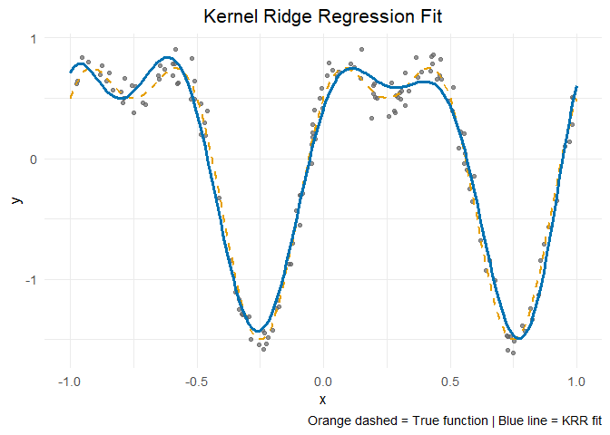

# Kernel Ridge Regression (KRR) Example

A simple example using `krr_fit()` and `predict()`  
to visualize the fitted Kernel Ridge Regression curve.

------------------------------------------------------------------------

## Example

``` r
# 필요한 패키지
library(ggplot2)

# 1. 데이터 생성
set.seed(1)
n = 150
X = matrix(runif(n, -1, 1), ncol = 1)
ftrue = function(x) sin(2*pi*x) + 0.5*cos(4*pi*x)
y = ftrue(X[, 1]) + rnorm(n, sd = 0.1)

# 2. KRR 모델 함수
krr_fit = function(X, y, rho = 3, lambda = 1e-4) {
  n = nrow(X)
  K = matrix(0, n, n)
  for (i in 1:n)
    for (j in 1:n)
      K[i, j] = exp(-rho * sum((X[i, ] - X[j, ])^2))
  coef_hat = solve(K + lambda * diag(n), y)
  list(coefficients = coef_hat, rho = rho, X = X, y = y)
}

# 3. 예측 함수
predict.krr = function(object, newdata, ...) {
  X_train = object$X
  n_train = nrow(X_train)
  n_new = nrow(newdata)
  K_new = matrix(0, n_new, n_train)
  for (i in 1:n_new)
    for (j in 1:n_train)
      K_new[i, j] = exp(-object$rho * sum((newdata[i, ] - X_train[j, ])^2))
  as.vector(K_new %*% object$coefficients)
}

# 4. 모델 적합
fit = krr_fit(X, y, rho = 3, lambda = 1e-4)

# 5. 예측 및 시각화
grid_x = seq(-1, 1, length.out = 200)
X_new = matrix(grid_x, ncol = 1)
y_pred = predict.krr(fit, X_new)

data_true  = data.frame(x = grid_x, y = ftrue(grid_x))
data_pred  = data.frame(x = grid_x, y = y_pred)
data_train = data.frame(x = X[, 1], y = y)

# 6. 그래프 출력
ggplot() +
  geom_point(data = data_train, aes(x = x, y = y), color = "gray40", alpha = 0.7) +
  geom_line(data = data_true, aes(x = x, y = y),
             color = "#E69F00", linetype = "dashed", size = 1) +
  geom_line(data = data_pred, aes(x = x, y = y),
             color = "#0072B2", size = 1.2) +
  labs(
    title = "Kernel Ridge Regression Fit",
    x = "x", y = "y",
    caption = "Orange dashed = True function | Blue line = KRR fit"
  ) +
  theme_minimal(base_size = 13) +
  theme(plot.title = element_text(hjust = 0.5))
```


